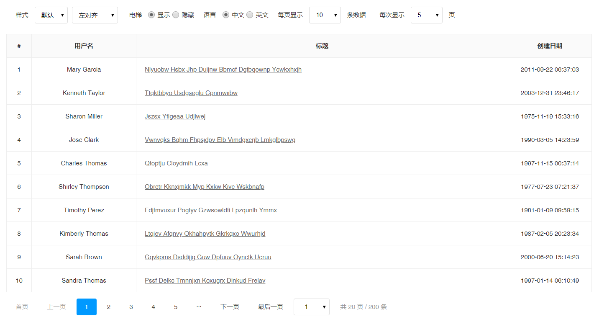

# jQuery Static Pager


> 基于 jQuery 的静态数据分页组件。



## 用法

本插件依赖于 jQuery 1.8+，在引用本插件前，请确保 jQuery 已正确引入。并准备必要的调用结构。

当前源码自带一个示例文件，可前往 `./example/index.html` 查看。

```html
<div class="body"><!-- 在此渲染数据 --></div>
<div class="pager"><!-- 在此渲染分页 --></div>

<link rel="stylesheet" href="jquery.pager.min.css" />
<script src="jquery.min.js"></script>
<script src="jquery.pager.min.js"></script>
<script>
  $(function () {
    // 新建一个变量存储数据
    var lists = [];

    // 新建一个函数用于渲染列表
    function redner(page, options, pager) {
      if (lists.length === 0) return;

      // 每次从实际分页减去 1，得到初始偏移量
      page -= 1;

      var _start = page * options.size; // 偏移量 * 每页数据条数得到截取的开始位置
      var _rows = lists.slice(_start, _start + options.size);

      console.log('本页数据：', _rows);

    };

    // 初始化获取数据并调用插件
    $.ajax({
      method: 'GET',
      url: './data.json',
      success: function (res) {
        // 更新数据
        lists = res.data;

        // 调用插件
        $('.pager').pager({
          total: lists.length,
          onChange: redner
        });
      }
    });

  });
</script>
```

## 开发

本工程基于 [Node.js](https://nodejs.org/en/) 8.12.0 开发，构建时请确保本机已安装 8.12.0 或更高版本的 Node.js。

```bash
# 环境检测
$ node -v

# 安装构建依赖
# ==============================================================
# 如果 npm install 执行失败，可配置为淘宝的镜像，使用下面的命令：
#
# npm install -g cnpm --registry=https://registry.npm.taobao.org
#
# 然后使用 cnpm install 执行依赖安装。参考：http://npm.taobao.org/
# ==============================================================
$ npm install

# 运行一个可实时调试开发的本地 web 服务
# 可通过 http://127.0.0.1:8888/ 访问
$ npm run dev

# 构建为可部署的代码
$ npm run build
```

## 配置参数

### current

指定显示的页码，正整数。插件调用成功后会自动切换到改页。默认为 `1`，页面不能小于 1，不能大约最大页数。

### total

**必须**参数，数据总条数，正整数，默认为 `0`。

### size

每页显示数据条数，正整数，默认为 `10`。

### span

可查看的页数，正整数，默认为 `10`。`lite` 模式下无效。

### mode

主题样式，`default` 默认样式，`simple` 简约样式、`lite` 极简样式。

### showTotal

是否在末尾显示统计信息，默认为 `true`。

### showElevator

是否显示下拉表单，下拉表单可快速选择页码，默认为 `true`。

### onChange

分页选择时执行的回调，该回调支持参数，分别是：`page`当前页码、`options` 实例的配置项、`pager` 实例。

## 关于

Copyright &copy; 2011 - 2019 tPeriod Tech
